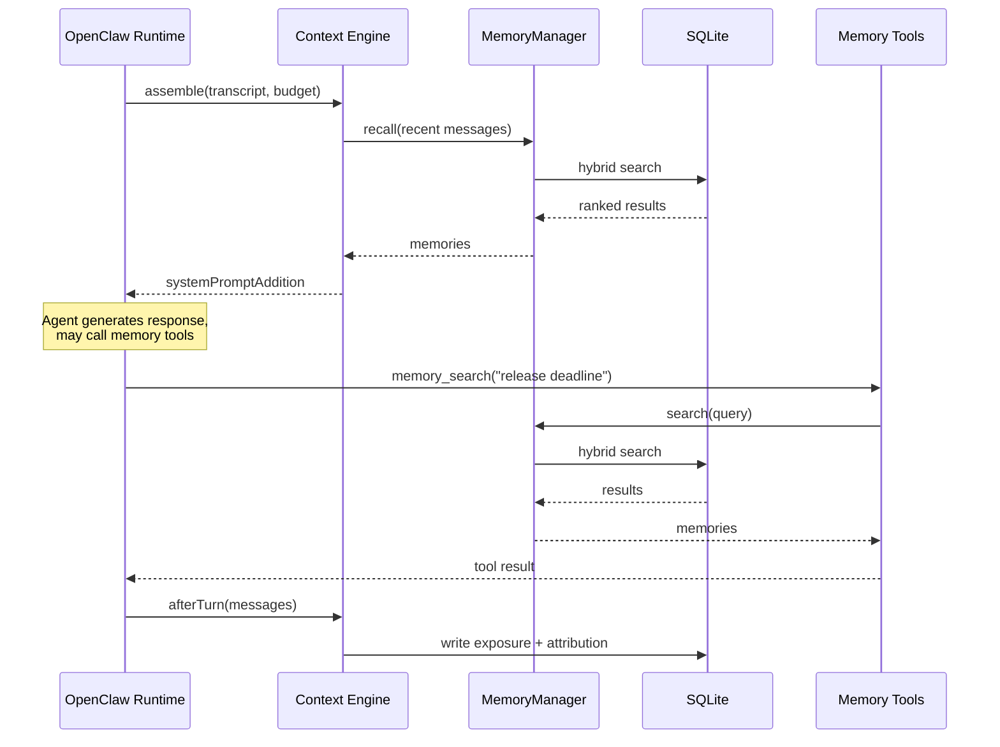
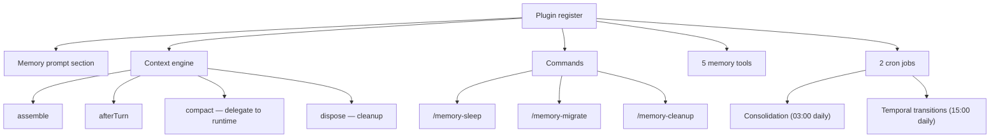
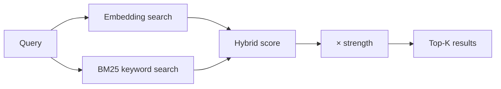
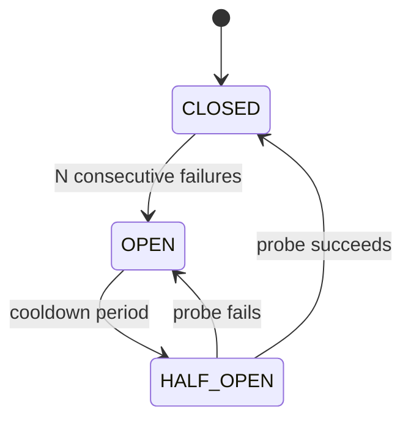

# Formative Memory Architecture

Formative Memory claims both the **memory** and **contextEngine** slots in OpenClaw, giving it full control over the memory lifecycle. It stores memories in SQLite, retrieves them through a hybrid semantic + keyword pipeline, automatically injects relevant memories into the agent's context, tracks how memories influence responses, and consolidates the memory store on a daily schedule.

This document covers integration, storage, retrieval, provenance, and consolidation. For a conceptual overview of the memory model, see [How Formative Memory Works](./how-memory-works.md).

## How a turn works



1. **assemble** — the context engine estimates the remaining token budget, recalls relevant memories, deduplicates against memories already visible through tool calls, and injects them as a `systemPromptAddition`
2. **Tool calls** — during the turn, the agent may call `memory_store`, `memory_search`, `memory_get`, `memory_feedback`, or `memory_browse`. These update the deduplication ledger so the next `assemble` does not repeat them
3. **afterTurn** — after the agent responds, the engine records which memories were shown (exposure) and how they influenced the response (attribution)

## Runtime integration

The plugin registers the following components:



**Memory tools:** `memory_store`, `memory_search`, `memory_get`, `memory_feedback`, `memory_browse`.

**Context engine** implements `assemble()`, `afterTurn()`, `compact()`, and `dispose()`. Compaction is delegated to the OpenClaw runtime. Dispose resets per-run caches but does not reset the deduplication ledger — that is owned by the caller.

**Cron jobs** are registered on `gateway:startup` and run via the heartbeat system. Consolidation runs daily at 03:00 (full cycle: decay, reinforce, merge, prune). Temporal transitions run at 15:00 (future → present → past based on anchor dates). Both can also be triggered manually via `/memory-sleep`.

**Workspace isolation** — each unique combination of memory directory, embedding model, and API key gets its own manager instance, circuit breaker, and database. The plugin tracks the most recently accessed workspace so the context engine and tools coordinate on the same state. This assumes a single active workspace per process — concurrent multi-workspace use within one OpenClaw process is not supported.

## Storage model

### SQLite (canonical source)

The database `associations.db` runs in WAL mode with foreign keys enabled.

**Core tables:**

| Table | Purpose | Primary key |
|-------|---------|-------------|
| `memories` | Memory records with content, strength, type, temporal state | `id` (SHA-256 of content) |
| `associations` | Weighted bidirectional links between memory pairs | `(memory_a, memory_b)` lexicographic |
| `memory_embeddings` | Vector embeddings (Float32 blob) | `id` |
| `memory_fts` | FTS5 full-text search index | `id` |
| `state` | Key-value store (e.g. `last_consolidation_at`) | `key` |

**Provenance tables:**

| Table | Purpose | Lifetime |
|-------|---------|----------|
| `turn_memory_exposure` | Which memories were shown per turn and how | Ephemeral (GC'd after 30 days) |
| `message_memory_attribution` | How memories influenced responses, with confidence | Durable (survives deletion) |
| `memory_aliases` | Maps old IDs to canonical IDs after merge/delete | Durable |

Example memory row:

```json5
{
  id: "a1b2c3d4e5f6...",
  content: "Alpha release deadline is April 15",
  type: "fact",
  strength: 0.85,
  temporal_state: "future",
  temporal_anchor: "2026-04-15T00:00:00.000Z",
  source: "agent_tool",
  consolidated: false,
  created_at: "2026-03-20T14:30:00.000Z"
}
```

All timestamps use UTC ISO-8601 for lexicographic SQL comparison.

### No markdown files

SQLite is the sole data store. There are no generated markdown files (working.md, consolidated.md). Use CLI commands (`memory stats`, `memory inspect`) or the `memory_browse` / `memory_search` tools to inspect memory contents.

### retrieval.log (append-only)

An operational log of retrieval events, written during normal operation and consumed during consolidation for reinforcement calculations:

```text
2026-03-15T14:30:00.000Z search   a1b2c3d4 e5f6a7b8
2026-03-15T14:30:01.000Z recall   a1b2c3d4
2026-03-15T14:31:00.000Z feedback a1b2c3d4 rating=4
2026-03-15T14:32:00.000Z store    f1e2d3c4
```

## Retrieval pipeline

Search combines semantic and keyword matching, weighted by memory strength:



Both scores are normalized to a 0–1 range before combining. The hybrid score weights embedding similarity at 60% and BM25 at 40% (`ALPHA = 0.6`). When embeddings are unavailable, the system falls back to BM25-only (`ALPHA = 0`). The final score is multiplied by the memory's strength (clamped to 0–1), so weak memories rank lower regardless of textual relevance.

### Embedding circuit breaker

The embedding service may be slow or unavailable. A circuit breaker protects against this:



| Parameter | Default |
|-----------|---------|
| Failure threshold | 2 consecutive failures |
| Timeout | 3 s (cooperative AbortSignal) |
| Cooldown | 30 s ± jitter (±50% by default) |

When the circuit is open, search falls back to BM25-only mode and the agent is informed of the degraded state. Recovery happens automatically when the probe succeeds.

### Deduplication ledger

The context engine tracks which memories the agent has already seen through tool calls. If `memory_search` returns a memory, the next `assemble()` skips it. This prevents the same memory from appearing twice in the same turn.

Tool calls increment a version counter in the ledger. The version is part of the `assemble()` cache key, so tool activity correctly invalidates the cache.

## Provenance

### Exposure

Each turn records which memories were shown and through which channel:

| Mode | Meaning |
|------|---------|
| `auto_injected` | Recalled automatically by `assemble()` |
| `tool_search_returned` | Returned by `memory_search` |
| `tool_get` | Returned by `memory_get` |
| `tool_store` | Created by `memory_store` |

Exposure records are ephemeral — garbage collected after 30 days.

### Attribution

Attribution records link memories to the messages they influenced:

| Evidence | Confidence |
|----------|------------|
| `auto_injected` | 0.15 |
| `tool_search_returned` | 0.3 |
| `tool_get` | 0.6 |
| `agent_feedback_neutral` (rating 3) | 0.4 |
| `agent_feedback_positive` (rating 4–5) | 0.95 |
| `agent_feedback_negative` (rating 1–2) | −0.5 |

Explicit feedback always overrides implicit attribution. Attribution is durable — it survives memory deletion and merging. During consolidation, attributions drive reinforcement: memories with high-confidence attributions get a strength boost.

### Aliases

When memories are merged or deleted, `memory_aliases` maps old IDs to their canonical replacements. This preserves the attribution chain: you can trace which current memory inherited the history of a deleted one.

## Consolidation

Consolidation runs automatically via cron (daily at 03:00) and can be triggered manually with `/memory-sleep`.

The process runs in two database transactions:

### Transaction 1: Pre-merge deterministic steps

1. **Catch-up decay** — if consolidation was missed for multiple days, applies accumulated decay (capped at a maximum number of catch-up cycles to prevent amnesia)
2. **Reinforcement** — processes unprocessed attributions: `Δstrength = η × confidence × modeWeight` (η = 0.7). Strength is clamped to 0–1 after each update
3. **Decay** — working memories ×0.906, consolidated ×0.977, associations ×0.9
4. **Co-retrieval associations** — memories retrieved in the same turn get linked. Weights combine via probabilistic OR: `w_new = w_old + w_add − w_old × w_add`, which keeps weights in the 0–1 range
5. **Transitive associations** — 1-hop indirect links computed (max 100 per run)
6. **Temporal transitions** — future → present → past based on anchor dates
7. **Pruning** — memories with strength ≤ 0.05 and associations with weight < 0.01 are deleted

### Merge (between transactions)

Merge runs outside a transaction because it calls an LLM (async):

1. **Candidate detection** — delta approach: new/recently-exposed memories (sources, strength ≥ 0.5) are compared against existing memories (targets, strength ≥ 0.3). Similarity scored by Jaccard + cosine (threshold ≥ 0.5 combined, or ≥ 0.6 Jaccard-only when embeddings are unavailable). Max 20 pairs per run
2. **Execution** — each pair produces one of: absorption (one subsumes the other), reuse (matches an existing third memory), or a novel merged memory. Merged memories are marked as consolidated
3. **Inheritance** — the merged memory inherits associations via probabilistic OR (`w = a + b − ab`); aliases are recorded

### Transaction 2: Finalization

Always runs (even if merge fails) to advance the consolidation clock and prevent double-decay:

1. **Provenance GC** — exposure records older than 30 days are deleted
2. **Timestamp update** — `last_consolidation_at` is set to the consolidation cutoff time

## Configuration

All settings are optional — defaults work out of the box. Configuration goes in `openclaw.json` under the plugin entry:

```json5
{
  "plugins": {
    "entries": {
      "formative-memory": {
        "enabled": true,
        "config": {
          "autoRecall": true,
          "autoCapture": true,
          "requireEmbedding": true,
          "embedding": {
            "provider": "auto"
          },
          "consolidation": {
            "notification": "summary"
          },
          "temporal": {
            "notification": "summary"
          }
        }
      }
    }
  }
}
```

| Setting | Type | Default |
|---------|------|---------|
| `autoRecall` | boolean | `true` |
| `autoCapture` | boolean | `true` |
| `requireEmbedding` | boolean | `true` |
| `embedding.provider` | `"auto"` \| `"openai"` \| `"gemini"` | `"auto"` |
| `embedding.model` | string | provider default |
| `dbPath` | string | `~/.openclaw/memory/associative` |
| `verbose` | boolean | `false` |
| `consolidation.notification` | `"off"` \| `"summary"` \| `"detailed"` | `"off"` |
| `temporal.notification` | `"off"` \| `"summary"` \| `"detailed"` | `"off"` |
| `logQueries` | boolean | `false` |

API keys are read from OpenClaw's `auth-profiles.json` — environment variables are not used. See the [README](../README.md#api-keys) for profile configuration details.

## CLI diagnostic tool

The `memory` CLI reads the database directly and does not require the OpenClaw runtime:

```bash
# Overview of the memory store
memory stats ~/.openclaw/memory/associative

# Search for memories
memory search ~/.openclaw/memory/associative "release deadline"

# Inspect a specific memory with its associations and provenance
memory inspect ~/.openclaw/memory/associative a1b2c3d4

# Export the full database as JSON
memory export ~/.openclaw/memory/associative > backup.json
```

| Command | Purpose |
|---------|---------|
| `stats <dir>` | Counts, last consolidation timestamp |
| `list <dir>` | List memories (filters: `--type`, `--state`, `--min-strength`, `--limit`) |
| `inspect <dir> <id>` | Full details for one memory |
| `search <dir> <query>` | FTS keyword search |
| `history <dir> <id>` | Memory lifecycle timeline |
| `graph <dir>` | Association graph (JSON or Graphviz DOT with `--format dot`) |
| `export <dir>` | Full DB export (JSON) |
| `import <dir> <file>` | Import from JSON backup |

Output is JSON by default; use `--format text` for human-readable output.

## Current limitations

- Associations do not influence recall — they are structural data used only during consolidation for co-retrieval tracking and transitive link building.
- Do not run CLI write commands (`import`) while the OpenClaw runtime is active. The runtime caches state in memory and will not observe external database mutations, leading to inconsistent behavior.

See [How Formative Memory Works](./how-memory-works.md) for the conceptual model.
