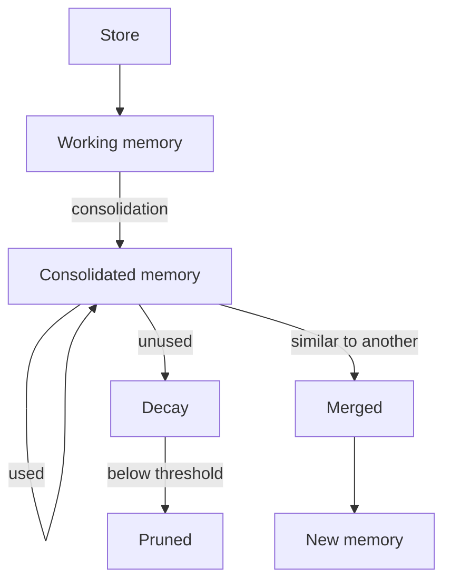

# How Formative Memory Works

Formative Memory gives an OpenClaw agent persistent, long-term memory that behaves more like human recall than a database lookup. Memories strengthen when used, weaken when neglected, form connections through shared context, and consolidate during periodic "sleep" cycles. The result is a memory system where important, frequently-used knowledge naturally surfaces while stale information gradually fades away.

## What this analogy does and does not mean

The biological metaphor is useful but has limits. Key differences from human memory:

- **Recall is ranked retrieval with association expansion**, not spreading activation. The system searches by meaning and keywords, then expands results through single-hop association links — but this is a targeted expansion step, not a continuous spreading activation process.
- **Strengthening is not immediate.** A memory gains strength only during the next consolidation cycle, based on how it was used.
- **"Sleep" runs on a schedule.** Consolidation runs automatically via cron (daily at 03:00) and can also be triggered manually with `/memory sleep`.

## A typical interaction

To make the system concrete, here is what happens during a normal conversation:

1. A user asks the agent about an upcoming release deadline.
2. Before the agent responds, the system automatically recalls a relevant memory: *"Alpha release deadline is April 15."*
3. The agent sees this memory in its context and uses it in the response.
4. Later in the conversation, the agent explicitly searches for related memories and finds deployment procedures.
5. The agent gives positive feedback on the deadline memory, marking it as useful.
6. During the next consolidation cycle, the deadline memory is reinforced (it influenced a response), the deployment memory decays slightly (it was not used), and the two memories form an association because they appeared together.

## What a memory looks like

Each memory is a self-contained unit:

- **Content** — free-form text: a fact, a decision, an observation, anything worth remembering
- **Identity** — derived from the content itself (SHA-256 hash). Same content always produces the same identity, preventing exact duplicates. This also means that two memories with identical text but different metadata (e.g. different type or temporal state) are considered the same memory — to store a revised version, the content itself must change
- **Strength** — a value between 0 and 1 representing how "alive" the memory is. New memories start at 1.0
- **Type** — a free-form label (e.g. `fact`, `decision`, `preference`)
- **Temporal state** — the memory's relationship to time: *future*, *present*, *past*, or *none* (timeless)

## Two channels of recall

The system surfaces memories through two complementary channels:

### Automatic recall

Before every response, the system examines the recent conversation and automatically recalls relevant memories. The agent does not request this — it happens transparently. The number of recalled memories adapts to the remaining context budget: more when space is plentiful, fewer when the context is tight, none when there is almost no space left.

Recall uses association-augmented search: after finding directly relevant memories, the system expands results through association links to surface related memories that might not match the query directly. See [Associations](#associations-links-between-memories) for details.

Automatically recalled memories are explicitly framed as data, not instructions. This reduces prompt injection risk through memory content, though it does not eliminate it entirely — model compliance with framing is probabilistic.

### Agent-initiated tools

The agent can also work with memories directly:

| Tool | Purpose |
|------|---------|
| `memory_store` | Save a new memory |
| `memory_search` | Find memories by keyword or meaning |
| `memory_get` | Retrieve a specific memory by ID |
| `memory_feedback` | Rate a memory's usefulness (1–5) |
| `memory_browse` | Browse memories by type, state, or strength |

If the agent has already seen a memory through a tool call, automatic recall skips it. This prevents the same information from appearing twice.

## How search works

When the system looks for relevant memories, it combines two methods:

- **Semantic search** finds memories with similar meaning, even if the words differ. *"shipping date"* can match a memory about *"release deadline."*
- **Keyword search** finds memories containing matching terms. This catches exact references that semantic search might miss.

The combined relevance score is weighted by the memory's strength. Strong memories rank higher; weak ones sink. If semantic search is unavailable, the system falls back to keyword-only search and informs the agent.

## Associations: links between memories

Memories form weighted, bidirectional links:

- **Co-retrieval** — when two memories appear in the same conversation turn, a link forms or strengthens between them. Cross-channel co-retrieval (one memory from auto-recall, the other from a tool call) creates stronger links than same-channel co-retrieval, since it signals independent relevance
- **Transitive links** — if A is linked to B and B to C, an indirect link may form between A and C
- **Decay** — unused links weaken over time

### Association-augmented recall

Associations actively participate in memory recall. When search finds relevant memories, the system expands results through single-hop association links:

1. Top search results above a score threshold become "seeds"
2. Each seed's strongly-associated neighbors are pulled into the candidate pool
3. Association candidates receive a score based on the seed's relevance, the link weight, and the neighbor's strength
4. All candidates (direct hits and association-expanded) compete in a single pool — scores determine ranking, with no reserved slots

This means that a memory which was never directly relevant to a query can still surface if it is strongly linked to memories that are. Convergent activation from multiple seeds (via probabilistic OR) can push an association candidate above direct search results when multiple relevant memories all point to it.

## Provenance: tracing memory influence

The system tracks how memories are used:

**Exposure** records which memories were shown to the model in each turn — whether through automatic recall, search results, or explicit retrieval.

**Attribution** records how memories influenced responses. Each attribution carries a confidence score: low for automatically recalled memories, moderate for search results, high for explicitly retrieved ones, and very high (or negative) for memories that received explicit agent feedback. Attribution is durable — it survives even if the memory itself is later deleted or merged.

Feedback can arrive in a later turn than the original memory use. The system links late feedback to the correct earlier attribution.

## Time-aware memories

Memories can carry a time anchor:

- A memory like *"demo scheduled for Friday"* is created with temporal state **future** and an anchor on Friday's date
- When Friday arrives, the memory transitions to **present**
- After Friday passes, the memory transitions to **past**

Temporal transitions happen during consolidation, not in real time. This means a memory's temporal state can lag behind the actual date until the next `/memory sleep` is run. Timeless memories (state **none**) have no anchor and do not transition.

## Consolidation: maintenance during sleep

Normal operation does not update memory strength, associations, temporal state, or consolidation status. It does write provenance records (exposure and attribution) and append to the retrieval log, but these are observational side effects — they do not change the memories themselves. All memory maintenance happens during **consolidation** — a batch process analogous to biological sleep. Consolidation runs automatically via cron (daily at 03:00) and can also be triggered manually with `/memory sleep`.

```mermaid
flowchart TD
    R[Reinforcement] --> D[Decay]
    D --> A[Association updates]
    A --> T[Temporal transitions]
    T --> P[Pruning]
    P --> M[Merging]
    M --> GC[Provenance cleanup]
```

What each step does:

1. **Reinforcement** — memories that influenced responses receive a strength boost proportional to their attribution confidence
2. **Decay** — all memory strengths decrease. Recent memories decay faster than established ones. Association weights also decay
3. **Association updates** — co-retrieval pairs get linked; transitive links are computed
4. **Temporal transitions** — future memories become present or past based on their anchor dates
5. **Pruning** — very weak memories and associations are deleted
6. **Merging** — similar memories are identified and combined. One may absorb the other, or a new merged memory is created. Old identities are preserved as aliases for traceability
7. **Provenance cleanup** — old exposure records are deleted; attribution history is preserved permanently

### The memory lifecycle

A new memory starts as **working** — recent and fast-decaying. After surviving a consolidation cycle, it becomes **consolidated** — established and slow-decaying. Active use reinforces it; neglect lets it fade. If it weakens below the pruning threshold, it is deleted. If it is similar enough to another memory, they may be merged into a new, combined memory.

## Auto-capture: how facts are extracted

When auto-capture is enabled, the plugin extracts durable facts from each conversation turn using an LLM. The extraction uses chain-of-thought reasoning: for each candidate fact, the LLM reasons about whether it is durable beyond the current task and marks it with a `durable_beyond_current_task` flag. Facts that are only relevant to the current task (e.g. "currently looking for a birthday gift") are discarded before storage.

The extraction prompt covers categories like people, identity, preferences, plans, goals, daily life, work, and knowledge. Most turns contain nothing worth remembering — returning zero facts is expected and correct.

### Salience profiles

A default `salience.md` file is created automatically in the memory directory if one does not already exist. This file is injected into both the auto-capture extraction prompt and the agent's system prompt (for `memory_store`), guiding what kinds of information are considered worth remembering. Edit it to match your priorities.

For example, a salience profile might emphasize health details, family relationships, or professional milestones depending on the user's priorities. The profile is treated as preference guidance — it cannot override the plugin's output format or extraction rules.

The file is read with mtime-based caching (no repeated disk I/O) and capped at 4000 characters. Content is wrapped in `<user_memory_preferences>` tags and explicitly subordinated to the extraction system's own rules, reducing prompt injection risk from user-authored content.

### Lifecycle coordination

Auto-capture extraction runs asynchronously after each turn (fire-and-forget) so it does not block the agent's response. The plugin tracks in-flight extractions and enforces a concurrency limit of 3. When the limit is reached, the oldest extraction is cancelled to make room — later turns carry more recent context and are preferred.

On shutdown, the plugin awaits all in-flight extractions via `Promise.allSettled()` before closing resources, preventing writes to a closed database. Callers can also cancel all extractions immediately (e.g. on session close) before dispose.

## Core principles

1. **Content is identity.** Same content produces the same memory. Exact-text duplicates are prevented at creation time. This is content-addressed deduplication, not semantic deduplication — two memories with different wording but the same meaning are distinct.

2. **Mutations only during consolidation.** Normal operation creates new memories and appends observational records (provenance, retrieval log). All strength updates, associations, pruning, and merging happen during sleep.

3. **Gradual forgetting.** Memories do not disappear suddenly — they weaken across consolidation cycles until they fall below the pruning threshold. Active use reinforces and prevents forgetting.

4. **Provenance is durable.** Attribution history survives memory deletion and merging, enabling retrospective analysis of which memories influenced which responses.

5. **Untrusted data.** Memory content is always framed as data, never as instructions, to reduce prompt injection risk.

## Current limitations

- Association expansion is single-hop only — deeper graph traversal is not performed
- Consolidation is synchronous and blocking
- Recall uses only the recent transcript as query context
- Numeric parameters (decay rates, pruning thresholds, search weights) are subject to tuning
- Semantic search depends on an external embedding service; degradation to keyword-only search is automatic but reduces recall quality

See [Architecture](./architecture.md) for implementation details, storage model, and configuration reference.
